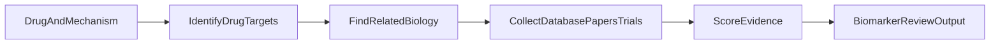

# OncoMOA: Oncology Biomarker Evidence Review

OncoMOA helps a translational pathologist or biomarker scientist review the
published and database-backed biomarker landscape for a cancer drug. Give it a
drug and its mechanism of action; it returns a ranked, traceable list of
candidate predictive or prognostic biomarkers.

It is designed for research and biomarker-discovery discussions—not for
patient-level clinical reporting.

## Who this is for

OncoMOA is intended for:

- Digital and molecular pathologists reviewing biomarker evidence
- Translational oncology teams planning assays or exploratory endpoints
- Researchers preparing a biomarker landscape for a drug program

It does **not**:

- Diagnose a patient or recommend treatment
- Call variants, interpret a patient's sequencing data, or generate a clinical report
- Analyze whole-slide images, quantify IHC, or measure spatial features
- Replace molecular tumor board review, expert curation, or clinical validation

## What you get

For a drug such as pembrolizumab, the tool can provide:

- A ranked list of biomarkers, such as PD-L1, PDCD1, TMB, or MSI
- The evidence records supporting each result
- A spreadsheet for review meetings
- A graph showing how the drug, targets, pathways, trials, and papers connect
- Optional plain-language narratives generated only from the retrieved evidence

Every result should be treated as a **hypothesis for expert review**, not as a
validated companion-diagnostic claim.

## How it works

Think of OncoMOA as a structured literature-and-database review that follows a
common translational workflow:



1. **Identify the drug target.** For example, pembrolizumab is linked to PDCD1.
2. **Look at related biology.** The tool examines pathways and biologically
   connected genes that may affect response or resistance.
3. **Collect evidence.** It searches curated cancer resources, clinical trials,
   population datasets, and PubMed.
4. **Score the evidence.** The ranking is reproducible and follows fixed
   weights; it is not decided by an AI model.
5. **Write optional summaries.** An AI model may turn already-ranked evidence
   into short explanations. It cannot add new biomarkers or citations.

### Why not just ask a chatbot?

A general chatbot may mix up drugs, diseases, variants, trial phases, or
citations. OncoMOA first retrieves records from named sources, stores each
finding with its source and identifier, then scores the evidence before any AI
summary is written.

## Evidence quality and safety

### The evidence gate

A candidate must have both:

1. At least one structured database or trial record, and
2. At least one PubMed publication

before it can be shown as a biomarker hypothesis. This reduces the chance that
a single database entry or one uncorroborated paper dominates the output.

### What happens when data are missing?

OncoMOA fails closed. If public databases cannot be reached or do not provide
enough linked evidence, it returns an empty biomarker list instead of guessing
from the drug mechanism. The output records failed sources and marks
`insufficient_evidence: true`.

### How to interpret the ranking

The score is a prioritization aid, not a clinical validation grade:

| Evidence signal | How it is used |
|---|---|
| CIViC evidence | Higher CIViC levels receive more weight |
| Clinical trials | Biomarker eligibility, stratification, and trial phase add weight |
| PubMed | Relevant publications add supporting weight |
| Direct target | A drug's known target receives a modest relevance bonus |
| Pathway link | Related genes can be considered but still must pass the evidence gate |

Population frequency from cBioPortal or GDC can help estimate prevalence and
study feasibility. It is not, by itself, proof that a biomarker predicts drug
response.

## Reading the output

Each run writes to `output/` by default, or to the folder provided with
`--output`.

| File | How a pathology or translational team might use it |
|---|---|
| `results.json` | Review each ranked hypothesis, score, source record, and run status |
| `evidence_summary.csv` | Open in Excel or a review meeting to filter and discuss evidence |
| `knowledge_graph.graphml` | Open in Cytoscape to trace drug → target → pathway → evidence links |
| `knowledge_graph.json` | Use in a downstream dashboard or script |

When reviewing `results.json`, start with:

- `biomarker`: the candidate gene, variant, or signature
- `biomarker_type`: predictive, prognostic, both, or still unknown
- `direction`: evidence for response or resistance
- `supporting_evidence`: source IDs and short claims to inspect
- `ranking_rationale`: counts of publications, trials, and curated evidence

An empty `hypotheses` list is a valid safety result. It means the tool did not
find enough linked evidence under its rules.

## Example: Pembrolizumab

For a live, deterministic pembrolizumab run, OncoMOA resolved **PDCD1** as the
direct target and produced a graph connecting the drug to immune-related
evidence. The highest-ranked candidates included PD-L1, PDCD1, TMB, and MSI.

These results illustrate the type of evidence review the tool supports. Their
clinical relevance still depends on tumor type, assay method, indication, line
of therapy, and current regulatory context.

## Quick start

Requires Python 3.10+ and access to the public biomedical services.

```bash
git clone https://github.com/briansang17/oncomoa-agent.git
cd oncomoa-agent

python3.10 -m venv .venv
source .venv/bin/activate
pip install -r requirements.txt
cp .env.example .env
```

Run a fully deterministic review without an AI narrative:

```bash
python3.10 main.py \
  --drug "pembrolizumab" \
  --moa "PD-1 immune checkpoint inhibitor" \
  --top-n 10 \
  --no-llm \
  --output output/pembrolizumab_run
```

The `--no-llm` option is recommended for an auditable first review. It keeps
the deterministic ranking and skips narrative generation.

For more commands, including a targeted therapy and an insufficient-evidence
example, see [examples/README.md](examples/README.md).

## Data sources at a glance

OncoMOA queries public sources in four practical groups:

| Question | Main sources |
|---|---|
| What does the drug target? | Open Targets, ChEMBL |
| What biology is nearby? | Ensembl, MyGene, UniProt, Reactome, WikiPathways |
| Is there biomarker evidence? | CIViC, DGIdb, MyVariant/ClinVar, PubMed, PubTator |
| Is it used or studied clinically? | ClinicalTrials.gov, cBioPortal, GDC/TCGA |

The system uses live public APIs. Source coverage and availability can vary
between runs, so always inspect the source list and the cited records.

## Knowledge graph: a review map, not a diagnostic engine

The graph links drug, target, pathway, disease, trial, publication, and
biomarker records. It makes the path to a hypothesis easier to inspect in
Cytoscape.

The graph can nominate biologically related genes for review. It cannot promote
a gene to a final result by itself: the gene still needs database and
publication support.

## Optional AI narratives

The ranking is always deterministic. The optional AI step only writes a short
explanation for candidates that have already passed the evidence gate.

- Standard targeted therapies can use a local Ollama model.
- Checkpoint inhibitors, bispecific antibodies, and antibody-drug conjugates
  can be routed to Gemini when configured.
- Use `--no-llm` to disable this step completely.

To use local narratives, install Ollama and download the configured model:

```bash
ollama pull meditron
```

Set `GEMINI_API_KEY` in `.env` only if you choose to use Gemini. An NCBI key is
optional and can increase PubMed request limits.

## Appendix A: Technical workflow

For readers who need implementation detail, the pipeline has nine focused
components:

| Stage | Plain-language role | Main sources |
|---|---|---|
| Drug resolution | Find the molecular target | Open Targets, ChEMBL |
| Target biology | Describe target function and disease links | Ensembl, MyGene, UniProt |
| Pathway expansion | Find related genes worth checking | Reactome, WikiPathways |
| Structured evidence | Retrieve curated and genomic records | CIViC, DGIdb, MyVariant, cBioPortal, GDC |
| Literature | Find and tag relevant publications | PubMed, PubTator |
| Trials | Check eligibility and exploratory biomarkers | ClinicalTrials.gov |
| Graph | Build the traceable evidence map | NetworkX |
| Ranking | Apply fixed evidence weights | Local deterministic code |
| Narrative | Explain already-ranked candidates | Optional Ollama or Gemini |

This is structured Graph-RAG: it retrieves named, structured evidence records
and represents their relationships in a graph. It is not a vector database,
graph database, or autonomous clinical decision-making system.

## Appendix B: Testing and reproducibility

Responses are cached locally for seven days when data are available. The output
also records successful and failed sources so a review can distinguish missing
evidence from a connectivity problem.

```bash
python3.10 -m pytest \
  tests/test_scoring.py \
  tests/test_schemas.py \
  tests/test_pipeline_safety.py -v
```

Integration tests contact live public APIs:

```bash
python3.10 -m pytest tests/test_integration.py -v
```
